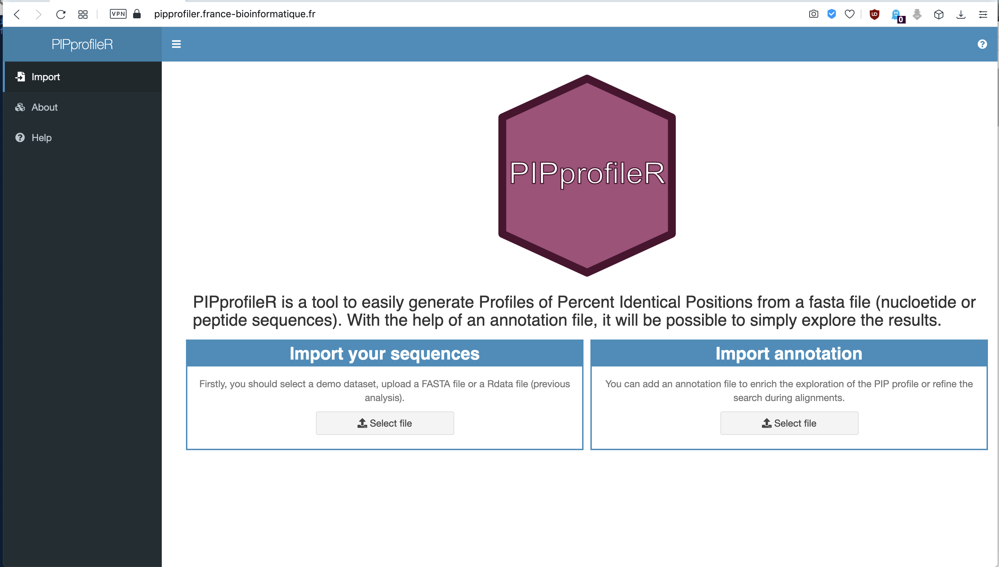
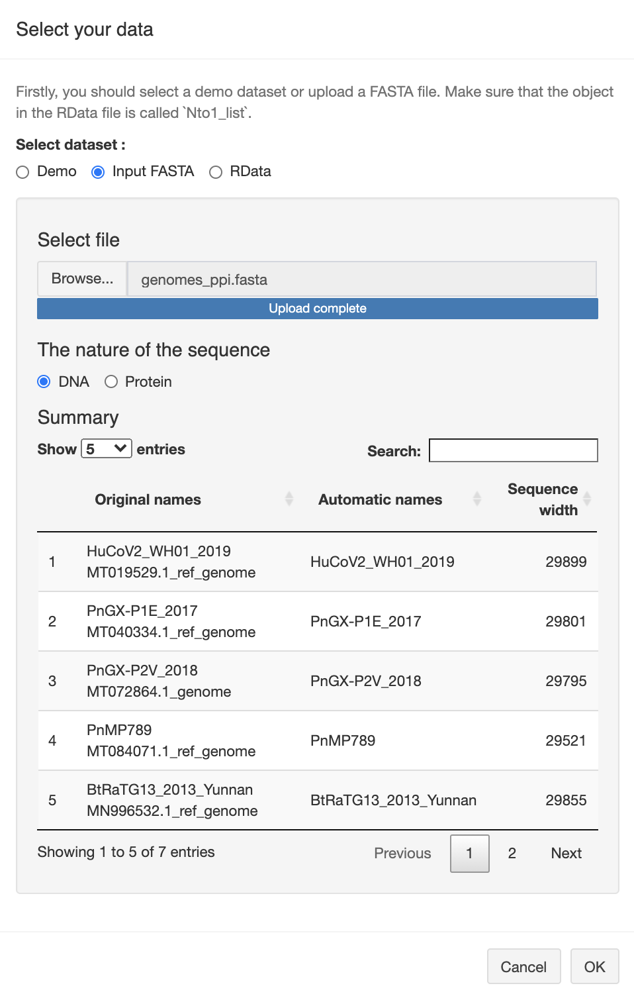
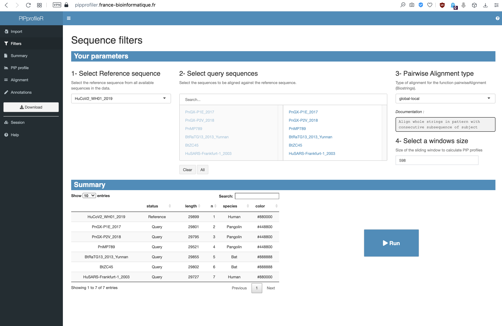
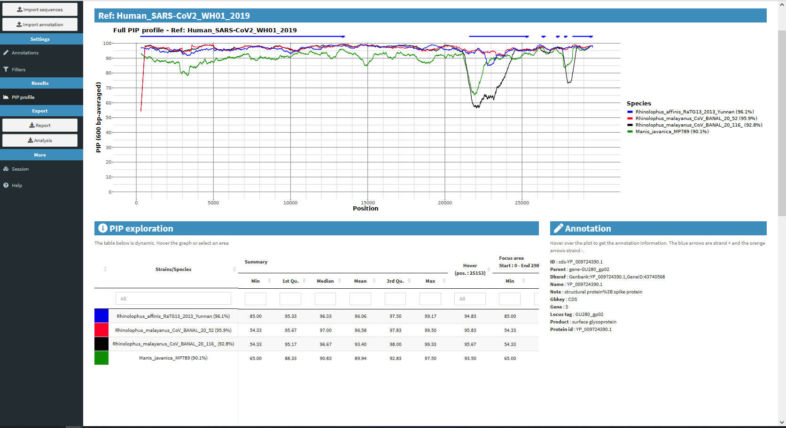

# TP2 - Alignement multiple et phylogénie moléculaire [[AMU](https://www.univ-amu.fr/) / [S&H](https://formations.univ-amu.fr/ME3SHU.html) / [N&C3](https://formations.univ-amu.fr/ME3SHU-S11XX3M1.html)] 


<link href="../tp.css" rel="stylesheet">

>Chaque TP est constitué d'une série d'exercices.
>
>1. Ouvrez deux fenêtres : une pour ce tutoriel et l'autre pour le QCM (questionnaire) associé au tutoriel (vous pouvez trouver le lien sur AMETICE).
>2.  Suivez ce tutoriel et faites les exercices. Les questions, mais pas les explications, se trouvent également dans le QCM.
>3.  Répondez aux questions au fur et à mesure dans le QCM.
>4. Attention! Si vous ne suivez pas le tutoriel, les questions de QCM peuvent être ambiguës. Ne faites pas l'impasse sur le tutoriel, c'est le cœur de l'apprentissage dans cet enseignement.
>5. Attention aux réponses libres du questionnaire :
>     Ecrivez les nombres sans espace et sans virgule. Par exemple : 9365589 à la place de 9 365 589 ou 9,365,589
>   * Utilisez le point pour les valeurs décimales. Par exemple 3.14 à la place de 3,14
>   * Si on demande un pourcentage écrivez uniquement le nombre sans le signe %. Par exemple 30 à la place de 30% ou 0.3
>   * Si on demande une proportion ne donnez pas la réponse en pourcentage. Par exemple écrivez 0.3 à la place de 30%


## Contenu

* Prérequis
* Introduction
* Objectifs
* Contrôle des connaissances
* Tutoriel
  * Exercice 1 - Profil de pourcentage de position identiques (PPI)
  * Exercice 2 - Inférence phylogénétique
* Ressources

## Prérequis

Le matériel de support est disponible ici: [[diapos CM1](../slides/NC3_enquete-bioinfo-origines-SARS-CoV-2_CM1.pdf)] [[diapos CM2](../slides/NC3_enquete-bioinfo-origines-SARS-CoV-2_CM2.pdf)]

* Biologie de SARS-CoV-2
* Bases de données biologiques
* Alignement par paire
* Recherche de séquences par similarité
* Profil d'identité
* Alignement multiple
* Construction et interprétation des arbres phylogénétiques


## Objectifs des TP

Le but de cette série de TP sera d'utiliser une série de méthodes bioinformatiques afin de retracer l'origine de SARS-CoV-2.

**Objectifs spécifiques**

- TP1 
    - Apprendre à formuler une requête structurée pour obtenir la liste des séquences dans une base de données.
    - Effectuer des alignements par paires.
    - Effectuer une recherche par similarité de séquences.

- TP2 
    - Interpréter de graphique de pourcentage de position identiques (PPI)
    - Effectuer des alignements multiples.
    - Inférer des arbres phylogénétiques basés sur différentes protéines des coronavirus.


## Contrôle des connaissances

Les tutoriels sont entrecoupés des questions auxquelles vous pouvez répondre en un ou quelques mots. Nous vous indiquerons, au fil de ce TP, les moments où il vous faudra encoder les réponses dans les questionnaires du site [d'Ametice](https://ametice.univ-amu.fr/mod/quiz/view.php?id=1673084). 


## Tutoriel

### Exercice 1 - Identification de recombinaisons entre virus à l'aide de profils de pourcentages de positions identiques (PPI) 

**But de l'exercice:** nous allons visualiser le profil de **pourcentage de position identiques** (**PPI**) entre le SARS-CoV-2 (considéré ici comme le *génome de référence*) et quelques autre coronavirus (*génomes requêtes*), pour identifier les virus les plus proches du SARS-CoV-2, et évaluer si ces degrés de proximité varient sur différentes régions du génome. 


**Identifiants des séquences génomiques** : nous allons analyser un fichier qui contient les séquences génomiques complètes de quelques coronavirus plus ou moins proches de SARS-CoV-2. Les identifiant des séquences commencent par le nom de hôte du virus. 

| Préfixe | Hôte |
|-----------|---------------------|
| Rhinolophus affinis | Chauve-souris |
| Rhinolophus malayanus | Chauve-souris |
| Manis javanica | Pangolin |
| Human | Humain |

1. Enregistrerez sur votre ordinateur le fichier  ([genomes_ppi_2021.fasta](../data/genomes/genomes_ppi_2021.fasta)) qui contient la génomes de SARS-Cov-2 et quatre autres génomes de coronavirus que nous allons comparer. 

2.  Enregistrerez sur votre ordinateur le **fichier d'annotations génomiques** [GCF_009858895.2_ASM985889v3_genomic.gff](../data/genomes/GCF_009858895.2_ASM985889v3_genomic.gff) contenant l'annotation du génome de SARS-Cov-2. Ce fichier contient la position des différents gènes dans le génome de SARS-CoV-2 et sera utilisé pour pouvoir interpréter les profils de PPI, ou pour focaliser l'analyse sur l'un ou l'autre gène.

3. Connectez-vous au site de  [PIPprofileR](https://pipprofiler.france-bioinformatique.fr) 


<a href="images/01_PIPprofileR-home.png">

</a>

4. Cliquez sur "Import sequence" et téléversez le fichier fasta que vous venez de sauvegarder sur votre ordinateur.

    - Cliquez sur **Import sequences** dans le menu 
    - Choisissez le bouton **Input FASTA** et sélectionnez le fichier *genomes_ppi_2021.fasta*.
    - Quand **Upload complete** est affiché, vérifiez dans la section **Summary** que les 5 génomes sont bien lus, assurez vous que **DNA** est choisi comme **Nature of the sequence** et cliquez sur **OK**.


<a href="images/02_import-fasta-sequence.png">

</a>

5. Dans l'onglet **Filters** vous pouvez faire une série de réglages

    - Assurez-vous que le génome Human_SARS-CoV2_WN01_2019 est sélectionné comme référence dans la fenêtre **1 - Select Reference sequence**. Cette séquence sera comparée à toutes les autres du jeux de données.
    - Dans la fenêtre **2 - Select query sequences**, les séquences disponibles sont affichées à gauche, les séquences sélectionnées sont à droite. Assurez-vous que tous les séquences sont sélectionnées pour la comparaison.
    - Choisissez *global-local* dans l'étape **3 - Pairwise Alignment type**
    - Entrez *600* dans **4- Select a windows size**. Le pourcentage d'identité sera calculé pour chaque fragment de 600 nucléotides. On dit que 600 est la *longueur de la fenêtre*.


<a href="images/03_sequence-filters.png">

</a>

6. Appuyer sur **Run** pour commencer les alignements et produire les graphique de PPI. Le calcul va prendre quelques minutes (durant lesquelles une fenêtre indique **Alignment in progress**).

7. Une fois le graphique affiché, vous pouvez charger les annotations génomiques afin de pouvoir interpréter les variations de PPI en fonction des gènes sous-jacents. Retournez à l'onglet **Import annotation** pour importer le fichier *GCF_009858895.2_ASM985889v3_genomic.gff* à PIPprofileR.

    - Dans la fenêtre **Import an annotation file**, choisissez le bouton **GFF3**
    - Sélectionnez le fichier *GCF_009858895.2_ASM985889v3_genomic.gff* dans la fenêtre **Select GFF3 file**
    - Cliquez sur **OK** quand **Upload complete** est affiché.

8. Retoutner à l'onglet **PIP profile**. Suite au chargement du fichier d'annotations génomiques, des flèches bleues épaisses se sont ajoutées en haut du graphique. Elles représentent les gènes décrits dans le fichier GFF que vous avez téléchargé. Si vous positionnez le curseur sur une flèche bleue, les annotations de séquences codantes apparaîtront dans la fenêtre **Annotation**.

9. Vous pouvez sélectionner des couleurs pour chaque séquence. Ce choix de couleur est très pratique si vous voulez mettre en valeur des séquences d'intérêt.

    - Allez dans **Settings** > **Colors**
    - Choisissez une séquence du menu déroulant et un couleur, en ajustant des curseurs de la boite **Select color**. 
    - Faites un mise à jour (**Update**) après chaque séquence. 

Nous vous conseillons les couleurs suivants
    - Bleu : Rhinolophus_affinis_RaTG13_2013_Yunnan
    - Rouge : Rhinolophus_malayanus_CoV_BANAL_20_52
    - Noir : Rhinolophus_malayanus_CoV_BANAL_20_116
    - Vert : Manis_javanica_MP789

<a href="images/PPI_genome_2021.png">

</a>

Focalisons-nous maintenant sur le **gène S**.

1. Dans **Feature Exploration**, sélectionnez je gène **S** (code pour la protéine Spike) et cliquer sur **Focus**. La graphique de PPI est mis à jour et uniquement le gène S est représenté. La graphique semble plus "lisse", car les le PPI sont calculés sur des fragments de 600 nucléotides, qui conviennent pour afficher un génome de 30 kb, mais deviennent trop larges quand on désire se focaliser sur un gène particulier.

2. Pour pouvoir comparer les séquences de Gène S de façon plus fine, fixez la largeur de la fenêtre à *120*  dans : **Settings > General > Size of the sliding window** et cliquez **Update**. Le graphique est mis à jour, et de nouveau, le PPI est affiché pour le génome complet. 

    - Revenez sur l'affichage de gène S en cliquant sur **Focus** dans **Feature exploraion**. 
    
3. Sélectionnez à l'aide du curseur un rectangle englobant la partie du graphique qui correspond au gène S. Les pourcentages d'identité moyens sur la région sélectionnée sont affichés dans **Exploration PIP > Selected area > Mean** 

4. Explorez les différents options offertes par l'outil PIPprofileR et repondez aux questions suivantes. Il sera utile à changer le focus de profiles PPI entre le génome complet et le gène S. Comme il est difficile d'afficher plusieurs PPI à la fois, vous trouverez la capture d'éran de PPI plus haut.


```question
Questions 1.1 Interpretation de Pourcentage de Positions Identiques (PPI , en anglais PIP) de génomes des coronavirus

1.1.1 Quel est le génome le plus similaire au génome de SARS-Cov2 ?

1.1.2 Sur combien de portions de la séquence ce virus a-t-il plus de 10% de différence qu'une autre séquence comparée à la séquence de référence ?

1.1.3 Quels sont les hôtes des virus ayant des portions plus proches de la séquences de référence que RaTG13 (Rhinolophus_affinis_RaTG13) sur le gène S? 

1.1.4 Les séquences issues des virus trouvés sur Rhinolophus malayanus ont été découvertes en 2021. Pourquoi a-t-on pensé en 2019 que SARS-Cov2 pourrait venir du pangolin (Manis javanica) ?

1.1.5 Sur quel gène se base l'hypothèse de 2019 selon laquelle le pangolin était le dernier hôte non humain de SARS-COV-2 ?

1.1.6 Pourquoi la découverte du virus Rhinolophus_malayanus_CoV_BANAL_20_52 est-elle importante? 

1.1.7 Quel génome possède un gène S le plus similaire au gène S de SARS-Cov2 ?

1.1.8 Quel génome possède un gène S est le moins similaire au gène S de SARS-Cov2 ?

1.1.9 Les génomes SARS-Cov2 et Rhinolophus_malayanus_CoV_BANAL_20_116 sont fort similaires sur la majorité du génome. Sur quel gène sont-ils les plus divergents ?
(Ne tenez pas compte des 600 premiers éléments de la séquence où nous suspectons un problème de séquençage/assemblage)

```


### Exercice 2 - Construction et interprétation des arbres phylogénétiques

Dans cet exercice, vous allez construire une arbre phylogénétique sur base de la *protéine Spike* de quelques coronavirus.

La construction des arbres suit les étapes suivantes.      

1. Alignement multiple des séquences.

2. Curation de l'alignement.  

3. Construction de l'arbre.

4. Visualisation et manipulations de l'arbre.

#### Création d'un arbre par NGphylogeny.fr

Le site de [NGphylogeny.fr](https://ngphylogeny.fr/) permet de faire un pipeline pour enchainer tous ces étapes tout en rendent disponible les résultats de chaque étape. 

1. Téléchargez le fichier [spike_proteins_2021.fasta](../data/spike-protein/spike_proteins_2021.fasta) et enregistrez-le sur votre ordinateur. 

2. Ce fichier contient les protéines spike de 24 coronavirus différents. 

3. Allez sur la page d'accueil de [NGphylogeny.fr](https://ngphylogeny.fr/). 

4. Choisissez l'option **A la carte** qui va vous permettre de choisir un logiciel pour chaque étape. 

5. Donnez un nom à votre analyse (**Name**), et choisissez les logiciels suivants pour chaque étape

    - **Multiple Alignment** : *MAFFT*
    - **Alignment Curation** : *BMGE*
    - **Tree Inference** : *FastME*
    - **Multiple Alignment** : *Newick Display*
  
6.  Créez le pipeline : cliquez (**Create workflow**)

7. Sélectionnez le fichier *spike_proteins_2021.fasta* dans la section **Input data**. 

8. Il est possible de paramétrer chaque logiciel de pipeline sur cette page en cliquant sur le signe **+** après le nom des logiciels. Cliquez sur le signe **+** après **FastME** et sélectionnez *yes* pour **Bootstrap branch supports**. Une fenêtre apparait. Entrez *100* à **Number of replicates**. Laissez les autres paramètres par défaut.

8. Cliquez sur **Submit** pour commencer les analyses. 

    **Suggestion :** indiquez votre mail dans la fenêtre de confirmation de la soumission. 

9. Au fur et à mesure de l'analyse, les liens apparaissent pour pouvoir découvrir le résultat de chaque étape.

>Si au bout de 5 minutes https://ngphylogeny.fr apparaît bloqué, vous pouvez utiliser le lien suivant pour accéder à une copie de secours des résultats : [Page de Résultats](https://ngphylogeny.fr/workspace/history/27b87941a3bbc668)

#### Analyse des résultats

##### Alignement multiple

1. Cliquez sur le bouton **MSAViewer** de Step 2 (**Mafft alignement**)

    - Le code couleur vous permet de visualiser facilement les positions conservées : les acides aminés similaires sont colorés par des couleurs voisines. 
    - Les gaps sont indiqués en blanc. 
    - Naviguez de gauche à droite pour explorer l'alignement dans son ensemble.   
    
 2. Identifiez le site de coupure de furine dans l'alignement: cliquez sur **Selection** dans le menu, choisssez **Find Motif** et tapez le motif **PRRA**.

```questions
Questions 2.1 - Alignement multiple

2.1.1 Quel est la longueur (nombre de colonnes) de l'alignement ? 

2.1.2. A quelle position de l'alignement commence le site de coupure de furine ?

2.1.3. Dans combien de séquences trouvez-vous un site de coupure de furine ?

2.1.4. Quels sont les hôtes des virus contenant des site de coupure de furin ?

Répondez par VRAI ou FAUX

2.1.5 La première moitié de l'alignement contient plus d'indels que la seconde. 
```


##### Curation de l'alignement

Cet étape permet de "nettoyer" l'alignement multiple, pour n'en retenir que les sites (colonnes de l'alignement) pertinents pour l'inférence phylogénétique qui suivra.
Dans un alignement multiple la position des gaps est souvent ambiguë, si les séquences ne sont pas fortement conservées. Pour cette raison, il est préférable de se baser sur les blocks (colonnes contigües dans l’alignement) sans les gaps ambiguës pour inférer des arbres phylogénétiques.

1. Pour revenir en arrière d'une étape, cliquez sur **Go back**.

2.  Cliquez sur **MSAViewer** de **Step 6 BMGE Cleaned sequences Fasta** pour visualiser les régions de l'alignement retenues par *BMGE*. La reconstruction phylogénétique sera basée uniquement sur celles-ci. 

```question
Questions 2.2 - Curation de l'alignement

2.2.1 Combien de positions ont été retenues pour la construction de l'arbre par BMGE ?

2.2.2 Combien de positions ont été suprimées par BMGE ?

2.2.3 Y a-t-il encore des gaps dans cet alignement ?

```

##### Manipulation et interprétation de l'arbre

1. Cliquez sur le bouton **Viewer** de **Step 15 Output Tree** pour visualiser l'arbre.

2. Prenez le temps de découvrir les différentes options d'affichage 

    - *Phylogram/Dendogram*
    - *Linear/Radial/Slanted*
    - *Display support values* : affiche les valeur de robustesse de chaque nœud
    - *Display branch length* : affiche la longueur de chaque branche (nombre des mutation per site)

3. L'arbre produit par la méthode de *FastME*  n'est pas enraciné. Cliquez sur n'importe quel noeud de l'arbre (ou séquence, du point de vue mathématique les séquences sont considérées comme noeuds). Un menu apparait. Choisissez **Reroot on this node**. pour placer la racine entre ce noeud et le reste de l'arbre. 

4. Placez la séquneces **Rhinolophus_cornutus_Rco319_LC556375_Japan_2013_CDS_S** comme groupe extérieur.

```question
Questions 2.3 - Interprétation de l'arbre

2.4.1 Selon votre arbre, quelle(s) séquence(s) de virus de chauves-souris (identifiant commençant par par Bt) est/sont les plus proches de la protéine Spike de SARS-CoV-2 (HuCoV2_WH01_2019) ?


2.4.2 Selon votre arbre, quelle(s) séquence(s) de virus de pangolins (identifiant commençant par Pn) est/sont les plus proches de la protéine Spike de SARS-CoV-2 (HuCoV2_WH01_2019) ?


2.4.3 Ceci est-il cohérent avec l'arbre des génomes de la Figure 1 du tutoriel ?

	a. Non, selon l'arbre de génomes la séquence PnMP789 est plus proche de la séqunece HuCoV2_WH01_2019 que les deux autres. Dans l'arbre de protéine spike, elle est la plus eloignée parmi les trois séquences de virus de pangolins.
	b. Oui, les 3 séquences des virus des pangolins sont tout aussi proches de HuCoV2_WH01_2019 dans les deux arbres.
	c. Oui, selon les deux arbres la séquence PnMP789 est plus proche de la séquence HuCoV2_WH01_2019 que les deux autres.
	
	
2.3.1 De quel hôte vient la séquence virale la plus proche des séquences de SARS-Cov2 sur humain ?

2.3.2. Selon cet arbre sur les données de proteine spike, combien de fois le pangolin aurait-il été contaminé à partir de chauve souris ?

2.3.4. Combien d'espèces de chauve-souris sont reprises dans ce dendrogramme ?

2.3.5. Combien de genres de chauve-souris sont repris dans ce dendrogramme ?

2.3.6. Une phylogénie obtenue sur l'ensemble du génome plutôt que sur la protéine spike donnerait-elle un  dendrogramme avec le même ordre des branchements (topologie) ?
```


## Ressources bioinformatiques


| Ressource | Description | URL |
|-----------|--------------------------------|-------------------------------|
| Supports de ce cours | Diapos, tuto, données | [jvanheld.github.io/shnc-origines-sars-cov-2/](https://jvanheld.github.io/shnc-origines-sars-cov-2/) |
| Uniprot | Base de donnée de séquences protéiques | [www.uniprot.org/](https://www.uniprot.org/) |
| NCBI Entrez | Bases de données biologiques | [www.ncbi.nlm.nih.gov/](https://www.ncbi.nlm.nih.gov/) |
| EMBOSS needle | Alignement de paires de séquences | [www.ebi.ac.uk/Tools/psa/emboss_needle/](https://www.ebi.ac.uk/Tools/psa/emboss_needle/) |
| NCBI BLAST | Recherche de séquences par similarité | [blast.ncbi.nlm.nih.gov/Blast.cgi](https://blast.ncbi.nlm.nih.gov/Blast.cgi) |
| PIPprofileR | Profils de pourcentages de positions identiques. Adresse permanente | [pipprofiler.france-bioinformatique.fr/](https://pipprofiler.france-bioinformatique.fr/) |
| Clustal | Alignement multiple | [www.ebi.ac.uk/Tools/msa/clustalo/](https://www.ebi.ac.uk/Tools/msa/clustalo/) |
| phylogeny.fr | Phylogénie moléculaire | [www.phylogeny.fr/](https://ngphylogeny.fr/) |
| NGphylogeny.fr | "Next Generation" phylogeny.fr | [NGphylogeny.fr](https://ngphylogeny.fr/) |
| AMU | page AMETICE de N&C3 | [ametice.univ-amu.fr/course/view.php?id=62928](https://ametice.univ-amu.fr/course/view.php?id=62928) |


