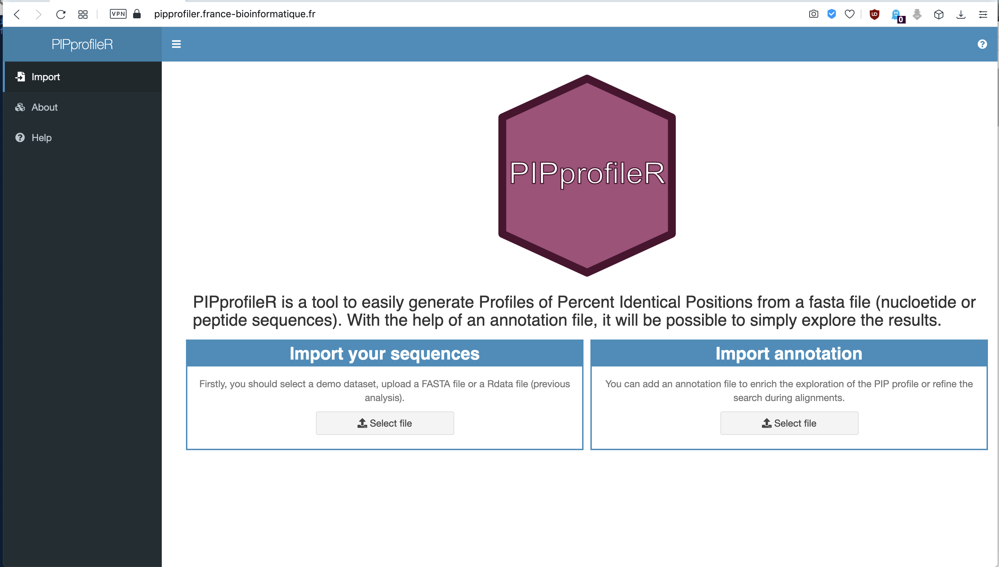
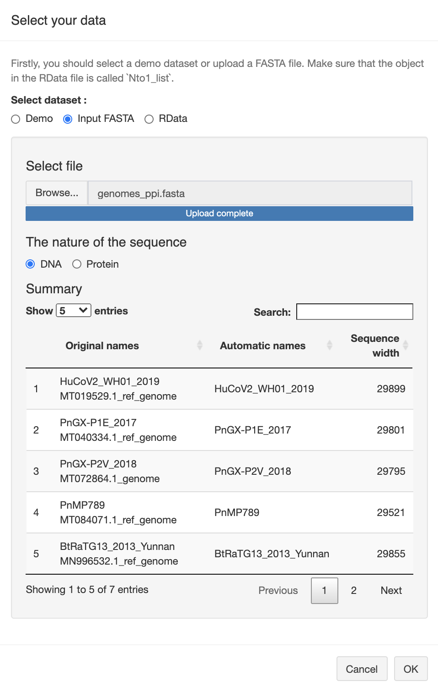
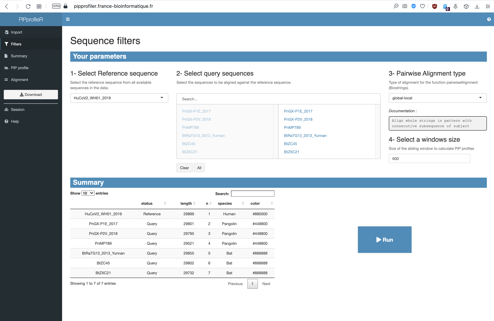

# TP2 - Alignement multiple et phylogénie moléculaire [[AMU](https://www.univ-amu.fr/) / [S&H](https://formations.univ-amu.fr/ME3SHU.html) / [N&C3](https://formations.univ-amu.fr/ME3SHU-S11XX3M1.html)] 


<link href="../tp.css" rel="stylesheet">

>Chaque TP est constitué d'une série d'exercices.
>
>1. Ouvrez deux fenêtres : une pour ce tutoriel et l'autre pour le QCM (questionnaire) associé au tutoriel (vous pouvez trouver le lien sur AMETICE).
>2.  Suivez ce tutoriel et faites les exercices. Les questions, mais pas les explications, se trouvent également dans le QCM.
>3.  Répondez aux questions au fur et à mesure dans le QCM.
>4. Attention! Si vous ne suivez pas le tutoriel, les questions de QCM peuvent être ambiguës. Ne faites pas l'impasse sur le tutoriel, c'est le cœur de l'apprentissage dans cet enseignement.
>5. Attention aux réponses libres du questionnaire :
>     Ecrivez les nombres sans espace et sans virgule. Par exemple : 9365589 à la place de 9 365 589 ou 9,365,589
>   * Utilisez le point pour les valeurs décimales. Par exemple 3.14 à la place de 3,14
>   * Si on demande un pourcentage écrivez uniquement le nombre sans le signe %. Par exemple 30 à la place de 30% ou 0.3
>   * Si on demande une proportion ne donnez pas la réponse en pourcentage. Par exemple écrivez 0.3 à la place de 30%


## Contenu

* Prérequis
* Introduction
* Objectifs
* Contrôle des connaissances
* Tutoriel
  * Exercice 1 - Profil de pourcentage de position identiques (PPI)
  * Exercice 2 - Inférence phylogénétique
* Ressources

## Prérequis

Le matériel de support est disponible ici: [[diapos CM1](../slides/NC3_enquete-bioinfo-origines-SARS-CoV-2_CM1.pdf)] [[diapos CM2](../slides/NC3_enquete-bioinfo-origines-SARS-CoV-2_CM2.pdf)]

* Biologie de SARS-CoV-2
* Bases de données biologiques
* Alignement par paire
* Recherche de séquences par similarité
* Profil d'identité
* Alignement multiple
* Construction et interprétation des arbre phylogénétiques


## Objectifs des TP

Le but de cette série de TP sera d'utiliser une série de méthodes bioinformatiques afin de retracer l'origine de SARS-CoV-2.

**Objectifs spécifiques**

- TP1 
    - Apprendre à formuler une requête structurée pour obtenir la liste des séquences dans une base de données.
    - Effectuer des alignements par paires.
    - Effectuer une recherche par similarité de séquences.

- TP2 
    - Effectuer des alignements multiples.
    - Inférer des arbres phylogénétiques basés sur différentes protéines des coronavirus pour pouvoir démontrer l'importance des recombinaisons entre différents virus.


## Contrôle des connaissances

Les tutoriels sont entrecoupés des questions auxquelles vous pouvez répondre en un ou quelques mots. Nous vous indiquerons, au fil de ce TP, les moments où il vous faudra encoder les réponses dans les questionnaires du site [d'Ametice](https://ametice.univ-amu.fr/mod/quiz/view.php?id=1673084). 


## Tutoriel

### Exercice 1 - Identification de recombinaisons entre virus à l'aide de profils de pourcentages de positions identiques (PPI) 

**But de l'exercice:** nous allons visualiser le profil de **pourcentage de position identiques** (**PPI**) entre le SARS-CoV-2 (considéré ici comme le *génome de référence*) et quelques autre coronavirus (*génomes requêtes*), pour identifier les virus les plus proches du SARS-CoV-2, et évaluer si ces degrés de proximité varient sur différentes régions du génome. 


1. Enregistrerez sur votre ordinateur le fichier  ([genomes_ppi.fasta](../data/genomes/genomes_ppi.fasta)) qui contient la génomes de SARS-Cov-2 et six autres génomes de coronavirus que nous allons comparer. 
    **Dans l'identifiant des séquences *Bt*, *Pn* et *Hu* indiquent l'hôte de chaque génome: Chauve-souris (Bat), Pangolin, Humain.**

2.  Enregistrerez sur votre ordinateur le **fichier d'annotations génomiques** [GCF_009858895.2_ASM985889v3_genomic.gff](../data/genomes/GCF_009858895.2_ASM985889v3_genomic.gff) contenant l'annotation du génome de SARS-Cov-2. Ce fichier contient la position des différents gènes dans le génome de SARS-CoV-2 et sera utilisé pour pouvoir interpréter les profils de PPI, ou pour focaliser l'analyse sur l'un ou l'autre gène.

3. Connectez-vous au site de [PIPprofileR](https://pipprofiler.france-bioinformatique.fr/) 


<a href="images/PIPprofiler_01_home.png">

</a>

4. Cliquez sur "Import sequence" et téléversez le fichier fasta que vous venez de sauvegarder sur votre ordinateur.

    - Dans la fenêtre **Import your sequences** cliquez sur **Select file**.
    - Choisissez le bouton **Input FASTA** et sélectionnez le fichier *genomes_ppi.fasta*.
    - Quand **Upload complete** est affiché, vérifiez dans la section **Summary** que les 7 génomes sont bien lus, assurez vous que **DNA** est choisi comme **Nature of the sequence** et cliquez sur **OK**.


<a href="images/PIPprofiler_02_import-sequence.png">

</a>


5. Retournez à l'onglet **Import** pour importer le fichier *GCF_009858895.2_ASM985889v3_genomic.gff* à PIPprofileR.

    - Dans la fenêtre **Import annotation** cliquer sur **Select file**
    - Choisissez le bouton **GFF3** et sélectionnez le fichier *GCF_009858895.2_ASM985889v3_genomic.gff*
    - Cliquez sur **OK** quand **Upload complete** est affiché.

6. Dans l'onglet **Filters** vous pouvez faire une série de réglages

    - Assurez-vous que le génome HuCoV2_WN01_2019 est sélectionné comme référence dans la fenêtre **1 - Select Reference sequence**. Cette séquence sera comparée à toutes les autres du jeux de données.
    - Dans la fenêtre **2 - Select query sequences**, les séquences disponibles sont affichées à gauche, les séquences sélectionnées sont à droite. Assurez-vous que tous les séquences sont sélectionnées pour la comparaison.
    - Choisissez *global-local* dans l'étape **3 - Pairwise Alignment type**
    - Laissez choisissez *600* dans **4- Select a windows size**. Le pourcentage d'identité sera calculé pour chaque fragment de 600 nucléotides. On dit que 600 est la *longueur de la fenêtre*.


<a href="images/PIPprofiler_03_sequence-filters.png">

</a>

7. Appuyer sur **Run** pour commencer les alignements et produire les graphique de PPI. Le calcul va prendre quelques minutes (durant lesquelles une fenêtre indique **Alignment in progress**).

8. Une fois le graphique affiché, vous pouvez sélectionner des couleurs pour chaque séquence. Ne passez pas trop de temps sur cette opération, car malheureusement le choix des couleurs sont remis par défaut quand vous allez changer d'autres paramètres d'affichage. Néanmoins, le choix de couleur est très pratique si vous voulez mettre en valeur une des séquences.

    - Allez dans Settings > Colors
    - choisissez une séquence du menu déroulant et un couleur, en ajustant des curseurs de la boite **Select color**. 
    - Faites un mise à jour (**Update**) après chaque séquence. 

9. En positionnant le curseur sur la ligne bleue en abscisse, les annotations de séquences codantes apparaissent dans la fenêtre **Annotation**.

```question
Questions 1.1 Pourcentage de Positions Identiques (PPI , en anglais PIP) de génomes des coronavirus

1.1.1 Quel génome a le pourcentage d'identité le plus élévé avec le SARS-CoV-2 (Reference: HuCoV2_WH01_2019) ?

1.1.2 Quel est son pourcentage d'identité avec le génôme de référence ? 

1.1.3 Quel est le pourcentage d'identité moyen entre la séquence PnMP789 et le HuCoV2_WH01_2019 ? 

1.1.4 Dans quel gène observez-vous une chute de pourcentage d'identité de plus de 5 % entre la séquence HuCoV2_WH01_2019 et BtRaTG13_Yunnan ? 

```

Focalisons-nous maintenant sur le **gène S**.

1. Dans **Feature Exploration**, sélectionnez **Genbank:YP_009724390.1,GeneID:43740568** (c'est l'identifiant du gène S) et cliquer sur **Focus**. La graphique de PPI est mis à jour et uniquement le gène S est représenté. La graphique devient plus "lisse", car les le PPI sont calculés sur des fragments relativement longs (600 nucléotides).

2. Changez la longueur de la fenêtre à *120* pour pouvoir comparer les séquences de Gène S plus en détail dans : **Settings > Size of the sliding window > Update**. Le graphique est mis à jour, et de nouveau, le PPI est affiché pour le génome complet. Revenez sur l'affichage de gène S en cliquant sur **Focus** dans **Feature exploraion**

3. Sélectionnez à l'aide du curseur un rectangle englobant la partie du graphique qui correspondant au gène S. Les pourcentages d'identité moyens sur la région sélectionnée sont affichés dans **Exploration PIP > Mean area** 

```question
Questions 1.2 PPI de gène S des coronavirus

1.2.1 Quel génome a le gène S le plus similaire (sur la longueur total du gène) à celui de le SARS-CoV-2 (Reference: HuCoV2_WH01_2019) ? 

1.2.2 Quel est ce pourcentage d'identié?

1.2.3 Quel est le pourcentage d'identité moyen entre les gènes S des séquences PnMP789 et le HuCoV2_WH01_2019 ?

```

4. Affichez la séquence *BtRATG13* en rouge et la séquence *PnMP789* en bleu pour mieux visualiser les courbes.

5. Sélectionnez sur le graphique la région la plus longue où la PPI de la séquence *PnMP789* est plus grande que celle de *BtRATG13*.

```question
Questions 1.3 PPI de gène S des coronavirus - région de recombinaison

1.3.1 Quel est le pourcentage d'identité moyen sur la zone selectionée entre les séquences BtRATG13 et le HuCoV2_WH01_2019 ?

1.3.2 Quel est le pourcentage d'identité moyen sur la zone selectionée entre les séquences PnMP789 et le HuCoV2_WH01_2019 ? 

Répondez par VRAI ou FAUX

1.3.3 La région selectionnée de génome de SARS-CoV-2 est probablement le résultat d'un recombinaison entre génomes. 

1.3.4 Cette recombinaison a eu lieu très probablement entre les génomes BtRATG13 et PnMP789.

1.3.5 La similarité entre ce fragment de génome PnMP789 et le SARS-CoV-2 est suffisamment elevée pour en déduire, que le génome le SARS-CoV-2 a obtenu un morceau de sa séquence du génome du virus de pangolin.

```


### Exercice 2 - Construction et interprétation des arbres phylogénétiques

La [Figure1](../figures/Figure_1_PhyML_based_on_genomes.PNG) représente un arbre phylogénétique construite sur base des génomes de quelques coronavirus. 
Dans cet exercice, vous allez construire une arbre phylogénétique sur base de *protéine Spike* de quelques coronavirus, comparer les arbres et tenter d'expliquer des éventuelles incohérences entre eux.

La construction des arbres suit les étapes suivantes.      

1. Alignement multiple des séquences.

2. Curation de l'alignement.  

3. Construction de l'arbre.

4. Visualisation et manipulations de l'arbre.

#### Création d'un arbre par NGphylogeny.fr

Le site de [NGphylogeny.fr](https://ngphylogeny.fr/) permet de faire un pipeline pour enchainer tous ces étapes tout en rendent disponible de résultats de chaque étapes. 

1. Télécharger le fichier [spike_proteins_16.fasta](../data/spike-protein/spike_proteins_16.fasta) et enregistrez le sur votre ordinateur. 
2. Ouvrir le fichier et regarder sa structure ? Combien de séquences contient-il ? Leurs longueurs ? ADN ou acides aminés ?
3. Ce fichier contient les protéines spike de 16 différents coronavirus. Les virus choisis pour votre analyses sont indiqués par une flèche rouge sur le [Figure1](../figures/Figure_1_PhyML_based_on_genomes.PNG) .
4. Rendez-vous sur le page d'accueil de [NGphylogeny.fr](https://ngphylogeny.fr/)
5. Choisissez l'option **A la carte** qui va vous permettre de choisir un logiciel pour chaque étape. 
6. Donnez un nom à votre analyse (**Name**), et choisissez les logiciels suivants pour chaque étape

  - **Multiple Alignment** : *MUSCLE*
  - **Alignment Curation** : *Gblocks*
  - **Tree Inference** : *PhyML+SMS*
  - **Multiple Alignment** : *Newick Display*
  
7.  Créez le pipeline : cliquez (**Create workflow**)
8. Sélectionnez le fichier *spike_proteins_16.fasta* dans la section **Input data**. Il est possible de paramétrer chaque logiciel de pipeline sur cette page en cliquant sur le signe *+* après le nom des logiciels. Nous allons commencer les analyses avec les paramètres par défaut.
9. Cliquer sur **Submit** pour commencer les analyses.
10. Au fur et à mesure de l'analyse, les liens apparaissent pour pouvoir découvrir le résultat de chaque étape.

>Si au bout de 5 minutes https://ngphylogeny.fr apparait bloqué, vous pouvez utiliser le lien suivant pour accéder aux résultats: [Page de Résultats](https://ngphylogeny.fr/workspace/history/678122897744d9fb)

#### Analyse des résultats

##### Alignement multiple

1. Cliquez sur le buton **MSAViewer** de Step 2 (**Muscle alignement**)
- Le code couleur vous permet de visualiser facilement les positions conservées, car les acides aminées similaires sont colorées de même type de couleur. Les gaps sont indiqués en blanc. 

```question
Questions 2.1 - Alignement multiple

2.1.1 Quel est la longueur de l'alignement (le nombre de positions de l'alignement) ? 

2.1.2 Quelle séquence apparait la plus divergente par rapport au autres ? 

Répondez par VRAI ou FAUX

2.1.3 La première moitié de l'alignement contient plus d'indels que la seconde. 

2.1.4 Les lettres en taille variables au-dessous de chaque position reflètent le niveau de la conservation de chaque site (colonne). 

```

##### Curation de l'alignement

Cet étape permet de "nettoyer" l'alignement multiple, pour n'en retenir que les sites (colonnes de l'alignement) pertinents pour l'inférence phylogénétique qui suivra.
Dans un alignement multiple la position des gaps est souvent ambiguë, si les séquences ne sont pas fortement conservées. Pour cette raison, il est préférable de se baser sur les blocks (colonnes contiguës dans l’alignent) sans gap pour inférer des arbres phylogénétiques.
Le logiciel Gblock ne fait pas qu'enlever les colonnes de l’alignement avec gaps, mais il élimine aussi les blocks sans gap trop courts, car ces positions se trouvent dans une région de l’alignent relativement peu fiable.


1. Pour retournez d'une étape cliquez sur **go back**
2.  **Cliquez sur l'icone .html** de **Step 6 Gblocks Sequences information** pour visualiser les régions de alignement retenues par Gblocks. Ces régions sont soulignées en bleu foncé. La construction phylogénétique sera basée uniquement sur elles. 
3. Vous pouvez voir l'alignement multiple qui contient uniquement des positions retenus en cliquant sur le bouton **MSAViewer** de **Step 5 Gblocks Cleaned sequences**.

```question
Questions 2.2 - Curation de l'alignement

2.2.1 Combien de positions ont été retenus pour la construction de l'arbre par Gblocks ? 

2.2.2 Combien de régions (blocks) ont été selctionnées ?

2.2.3 Combien de positions contient la région (block) la plus longue.

```

##### Manipulation est interprétation de l'arbre

1. Cliquez sur le bouton **Viewer** de **Step 8 PhyML newick tree** pour visualiser l'arbre.

2. L'arbre produit par la méthode de Maximum de vraisemblance (PhyML) est enraciné par un méthode automatique, généralement peu fiable. Nous pouvons placer la racine correctement (re-enraciner l'arbre) en se basant sur nos connaissances à priori. Par exemple, vous pouvez choisir l'emplacement de la racine sur base de l'arbre des génomes ([Figure1](../figures/Figure_1_PhyML_based_on_genomes.PNG)). 

```question

Questions 2.3 - Position de la racine

Répondez par VRAI ou FAUX

2.3.1 En se basant sur l'arbre des génomes de Figure 1 du tutoriel, la racine de l'arbre de protéines Spike devrait être placée entre la séqunece de HuMERS_172-06_2015 et les autres.

2.3.2 La longueur de la branche de la séquence HuMERS_172-06_2015 soutient la réponse à la question précédente.

```

3. Vous pouvez cliquer sur n'importe quel nœud ou séquences (de point de vue mathématique les séquences sont considérées comme nœuds) de l'arbre. Un menu apparait. Choisissez **Reroot on this node**. pour placer la racine entre ce nœud et le reste de l'arbre. 

4. Prenez le temps de découvrir les différentes options d'affichage 
- Phylogram/Dendogram
- Linear/Radial/Slanted
- Display support values: affiche les valeur de robustesse de chaque nœud
- Display branch length: affiche la longueur de chaque branche (nombre des mutation per site)

5.  Réenracinez correctement votre arbre PhyML. 


```question
Questions 2.4 - Interprétation de l'arbre

2.4.1 Selon votre arbre, quelle(s) séqunece(s) de virus de chauve souris (indentifiant commence par Bt) est/sont les plus proches à la protéine Spike de SARS-CoV-2 (HuCoV2_WH01_2019) pangolins sont les plus proches à la protéines 


2.4.2 Selon votre arbre, quelle(s) séqunece(s) de virus de pangolins (identifiant commence par Pn) sont les plus proches de la protéine  


2.4.3 Est-ce coherent avec l'arbre des génomes de Figure 1 du tutoriel ? 

	- Oui, les 3 séquences des virus des pangolins sont tout aussi proches de HuCoV2_WH01_2019 dans les deux arbres
	- Non, selon l'arbre de génomes la séqunece PnMP789 est plus proches à la séqunece HuCoV2_WH01_2019 que les deux autres. Dans l'arbre de protéine spike, elle est le plus eloignée parmi les trois séquences de pangolins.
	- Oui, selon les deux arbres la séqunece PnMP789 est plus proches à la séquneces HuCoV2_WH01_2019 que les deux autres.

```


## Ressources bioinformatiques


| Ressource | Description | URL |
|-----------|--------------------------------|-------------------------------|
| Supports de ce cours | Diapos, tuto, données | [https://jvanheld.github.io/shnc-origines-sars-cov-2/](https://jvanheld.github.io/shnc-origines-sars-cov-2/) |
| Uniprot | Base de donnée de séquences protéiques | [https://www.uniprot.org/](https://www.uniprot.org/) |
| NCBI Entrez | Bases de données biologiques | [https://www.ncbi.nlm.nih.gov/](https://www.ncbi.nlm.nih.gov/) |
| EMBOSS needle | Alignement de paires de séquences | [https://www.ebi.ac.uk/Tools/psa/emboss_needle/](https://www.ebi.ac.uk/Tools/psa/emboss_needle/) |
| NCBI BLAST | Recherche de séquences par similarité | [https://blast.ncbi.nlm.nih.gov/Blast.cgi](https://blast.ncbi.nlm.nih.gov/Blast.cgi) |
| PIPprofileR | Profils de pourcentages de positions identiques | [https://pipprofiler.france-bioinformatique.fr/](https://pipprofiler.france-bioinformatique.fr/) |
| Clustal | Alignement multiple | [https://www.ebi.ac.uk/Tools/msa/clustalo/](https://www.ebi.ac.uk/Tools/msa/clustalo/) |
| phylogeny.fr | Phylogénie moléculaire | [https://www.phylogeny.fr/](https://ngphylogeny.fr/) |
| AMU | page AMETICE de N&C3 | [https://ametice.univ-amu.fr/course/view.php?id=62928](https://ametice.univ-amu.fr/course/view.php?id=62928) |


